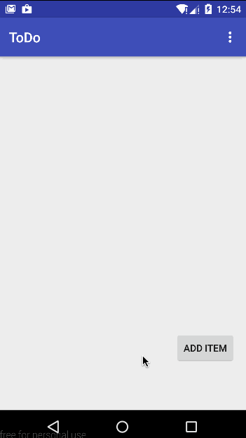

# To Do android app

This is an Android application for a to-do list.

Completed user stories:

 * [x] Required: User can successfully add items
 * [x] Required: User can successfully remove items
 * [x] Required: User can successfully edit existing items
 * [x] Required: User's to do list is persisted

Walkthrough of all user stories:

GIF created with [LiceCap](http://www.cockos.com/licecap/).